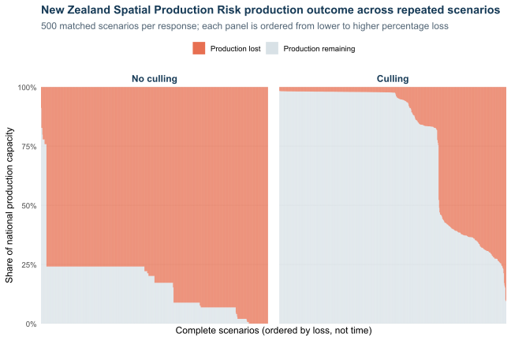
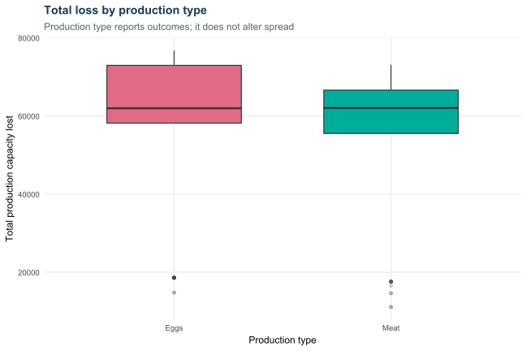
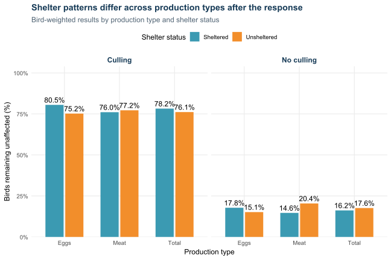
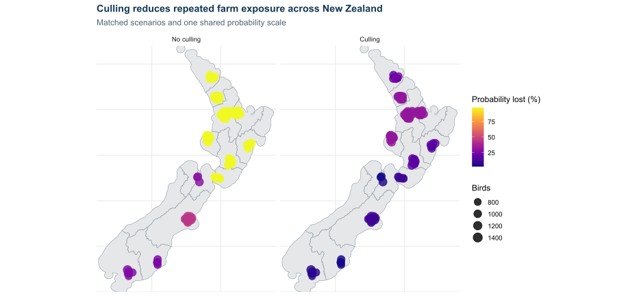

```{=html}
<style>
.table-note,
.figure-note {
  margin-top: -0.55rem;
  margin-bottom: 1.25rem;
  color: #7a8791;
  font-size: 0.82rem;
  line-height: 1.35;
}
.population-loss-table td[rowspan] {
  vertical-align: middle;
  font-weight: 600;
  background: #f5f7f8;
}
.key-findings {
  margin: 1rem 0 1.5rem;
  padding: 1rem 1.2rem 0.35rem;
  background: #fff7d6;
  border: 1px solid #eadb9a;
  border-left: 5px solid #d8bd55;
  border-radius: 0.35rem;
}
.key-findings-title {
  margin-bottom: 0.65rem;
  color: #5f5223;
  font-weight: 700;
}
</style>
```

```{r}
#| label: setup
config <- jsonlite::fromJSON("config.json")
results <- readRDS("assets/spatial_cascade_results.rds")
summary <- read.csv("assets/spatial_cascade_summary.csv")
types <- read.csv("assets/spatial_cascade_production_type_summary.csv")
farms <- results$farms
runs <- results$monte_carlo_runs
days <- config$model_parameters$simulation_days
capacity_unit <- config$production_metrics$production_capacity_unit
if (is.null(capacity_unit) || !length(capacity_unit)) capacity_unit <- "birds"
mean_loss_share <- 100 * summary$mean_production_loss /
  sum(farms$production_yield)
cull <- results$cull_comparison_summary
farm_risk <- results$farm_risk_summary
cull_farm_risk <- results$cull_farm_risk_summary
cull_average_survival <- results$cull_average_survival
north_name <- grep("^North", unique(farms$barrier_group), value = TRUE)[1]
south_name <- grep("^South", unique(farms$barrier_group), value = TRUE)[1]
initial_starts <- config$simulation_controls$initial_phase_c_entities

island_story <- function(group_name) {
  rows <- farms$barrier_group == group_name
  group_size <- sum(rows)
  start_probability <- 100 * (1 -
    choose(nrow(farms) - group_size, initial_starts) /
      choose(nrow(farms), initial_starts))
  group_risk <- mean(farm_risk$probability_lost_pct[
    farm_risk$barrier_group == group_name])
  sheltered_share <- 100 * mean(farms$is_sheltered[rows])
  data.frame(group = group_name, farms = group_size,
    start_probability = start_probability, mean_lost_probability = group_risk,
    sheltered_share = sheltered_share)
}

island_comparison <- rbind(island_story(north_name), island_story(south_name))
north <- island_comparison[island_comparison$group == north_name, ]
south <- island_comparison[island_comparison$group == south_name, ]
highest_loss_type <- types[which.max(types$mean_total_production_loss), ]
type_loss_order <- order(types$mean_total_production_loss, decreasing = TRUE)
type_loss_comparison <- paste(
  paste0(types$production_type[type_loss_order], ": ",
         format(round(types$mean_total_production_loss[type_loss_order]),
                big.mark = ","), " birds"),
  collapse = "; ")
```

## What this analysis tells us

Each modelled outbreak begins at
`r config$simulation_controls$initial_phase_c_entities` farms selected at
random from the national farm population. The analysis asks how many birds
could be lost, where those losses could occur, and how much difference a
culling response could make.

The results tell a national story first, then show which production types and
places carry the loss. The same possible events are considered with no culling
and with a culling response, making the practical value of the response easier
to see. The simulation method and guidance on using the analysis are in the
appendix.

## The main findings point to early action

::: {.key-findings}

<div class="key-findings-title">Key findings</div>

- Without culling, an outbreak could cause widespread bird losses across New
  Zealand.

- Acting early through culling could reduce the expected national loss by about
  **`r format(round(cull$mean_net_loss_avoided), big.mark = ",")` `r capacity_unit`**,
  or **`r round(cull$net_loss_reduction_pct, 1)`%**, under the current settings.

- No two outbreaks unfold in exactly the same way. Response planning should
  therefore allow for a range of possible losses, not rely on one estimate.

- Without culling, expected losses are **`r type_loss_comparison`**, making
  **`r highest_loss_type$production_type`** the production type carrying the
  largest total loss. North Island farms are also more exposed: their average
  chance of being lost is
  **`r round(north$mean_lost_probability, 1)`%**, compared with
  **`r round(south$mean_lost_probability, 1)`%** in the South Island. This is
  mainly because more farms are in the North Island, making a random start
  there more likely, while spread between islands is blocked.

- These findings can help compare response choices and focus preparedness.
  They should not be read as a forecast of a future outbreak.

:::

```{r}
#| label: production-reference-table
#| include: false
capacity_reference_row <- function(label, rows) {
  capacity <- farms$production_yield[rows]
  data.frame(
    `Production type` = label,
    Farms = length(capacity),
    `Total birds` = sum(capacity),
    `Share of all birds` = 100 * sum(capacity) /
      sum(farms$production_yield),
    `Average per farm` = mean(capacity),
    `Median per farm` = median(capacity),
    `Middle half per farm` = paste0(
      format(round(unname(quantile(capacity, .25))), big.mark = ","), " to ",
      format(round(unname(quantile(capacity, .75))), big.mark = ",")),
    `Minimum to maximum per farm` = paste0(
      format(round(min(capacity)), big.mark = ","), " to ",
      format(round(max(capacity)), big.mark = ",")),
    check.names = FALSE)
}
capacity_reference <- do.call(rbind, c(
  lapply(sort(unique(farms$production_type)), function(type) {
    capacity_reference_row(type, farms$production_type == type)
  }),
  list(capacity_reference_row("Grand total", rep(TRUE, nrow(farms))))))
capacity_reference$`Total birds` <- format(
  round(capacity_reference$`Total birds`), big.mark = ",")
capacity_reference$`Share of all birds` <- paste0(
  round(capacity_reference$`Share of all birds`, 1), "%")
capacity_reference$`Average per farm` <- paste(
  format(round(capacity_reference$`Average per farm`), big.mark = ","), capacity_unit)
capacity_reference$`Median per farm` <- paste(
  format(round(capacity_reference$`Median per farm`), big.mark = ","), capacity_unit)
capacity_reference$`Middle half per farm` <- paste(
  capacity_reference$`Middle half per farm`, capacity_unit)
capacity_reference$`Minimum to maximum per farm` <- paste(
  capacity_reference$`Minimum to maximum per farm`, capacity_unit)
```

## An outbreak could lead to substantial bird losses nationally

The clearest headline is the expected loss across the **whole farm
population**, rather than the loss at an average farm. Without culling, the
model estimates a loss of about
**`r format(round(cull$mean_baseline_total_loss), big.mark = ",")` `r capacity_unit`**.
With culling, that falls to about
**`r format(round(cull$mean_cull_total_loss), big.mark = ",")` `r capacity_unit`**.
That is an expected reduction of
**`r format(round(cull$mean_net_loss_avoided), big.mark = ",")` `r capacity_unit`**,
or **`r round(cull$net_loss_reduction_pct, 1)`%**. @tbl-expected-population-loss
shows how this national result is shared across production types and how much
the modelled outbreaks varied.

```{r}
#| label: tbl-expected-population-loss
#| tbl-cap: "Expected total bird losses across the whole farm population"
#| results: asis
make_population_rows <- function(scenario, risk_data, loss_log) {
  rows <- lapply(sort(unique(risk_data$production_type)), function(type) {
    in_type <- risk_data$production_type == type
    total_birds <- sum(risk_data$production_yield[in_type])
    expected_loss <- sum(risk_data$expected_loss_contribution[in_type])
    loss_share <- 100 * loss_log[, type] / total_birds
    data.frame(
      `Management response` = scenario,
      `Production type` = type,
      `Farms in population` = sum(in_type),
      `Birds in population` = total_birds,
      `Expected total birds lost` = expected_loss,
      `Expected share of birds lost` = 100 * expected_loss / total_birds,
      `Share p25` = unname(quantile(loss_share, .25)),
      `Share p75` = unname(quantile(loss_share, .75)),
      check.names = FALSE)
  })
  total_birds <- sum(risk_data$production_yield)
  expected_loss <- sum(risk_data$expected_loss_contribution)
  total_loss_share <- 100 * rowSums(loss_log) / total_birds
  rows[[length(rows) + 1L]] <- data.frame(
    `Management response` = scenario,
    `Production type` = "Total",
    `Farms in population` = nrow(risk_data),
    `Birds in population` = total_birds,
    `Expected total birds lost` = expected_loss,
    `Expected share of birds lost` = 100 * expected_loss / total_birds,
    `Share p25` = unname(quantile(total_loss_share, .25)),
    `Share p75` = unname(quantile(total_loss_share, .75)),
    check.names = FALSE)
  do.call(rbind, rows)
}

population_estimates <- rbind(
  make_population_rows("No culling", farm_risk,
                       results$production_loss_by_type_log),
  make_population_rows("Culling", cull_farm_risk,
                       results$cull_production_loss_by_type_log))
population_estimates$`Birds in population` <- format(
  round(population_estimates$`Birds in population`), big.mark = ",")
population_estimates$`Expected total birds lost` <- format(
  round(population_estimates$`Expected total birds lost`), big.mark = ",")
population_estimates$`Expected share of birds lost` <- paste0(
  round(population_estimates$`Expected share of birds lost`, 1), "% (",
  round(population_estimates$`Share p25`, 1), "% to ",
  round(population_estimates$`Share p75`, 1), "%)")
population_estimates$`Share p25` <- population_estimates$`Share p75` <- NULL

escape_html <- function(x) {
  x <- gsub("&", "&amp;", as.character(x), fixed = TRUE)
  x <- gsub("<", "&lt;", x, fixed = TRUE)
  x <- gsub(">", "&gt;", x, fixed = TRUE)
  gsub('"', "&quot;", x, fixed = TRUE)
}

headers <- names(population_estimates)
cat('<table class="table table-sm table-striped population-loss-table">\n<thead><tr>')
cat(paste0("<th>", escape_html(headers), "</th>", collapse = ""))
cat("</tr></thead>\n<tbody>\n")
for (response in unique(population_estimates$`Management response`)) {
  group_rows <- population_estimates[
    population_estimates$`Management response` == response, , drop = FALSE]
  for (i in seq_len(nrow(group_rows))) {
    cat("<tr>")
    if (i == 1L) {
      cat(sprintf('<td rowspan="%d">%s</td>', nrow(group_rows),
                  escape_html(response)))
    }
    cat(paste0("<td>", escape_html(unlist(group_rows[i, -1], use.names = FALSE)),
               "</td>", collapse = ""))
    cat("</tr>\n")
  }
}
cat("</tbody></table>\n")
```

```{=html}
<div class="table-note" role="note"><strong>How to read this table:</strong>
The expected share is the expected national loss divided by the birds
in that production type. Percentages in brackets show the 25th–75th percentile
range across complete modelled outbreaks with the assumptions held fixed. When
a farm is lost, all birds at that farm are counted as lost in that outbreak.</div>
```

The culling response creates an early, deliberate loss at identified farms to
stop a much larger chain. Its national total includes about
**`r format(round(cull$mean_direct_cull_loss), big.mark = ",")` `r capacity_unit`**
removed directly through culling. Even after counting those birds, total loss
was lower with culling in **`r round(cull$runs_with_lower_total_loss_pct, 1)`%
of the matched modelled outbreaks**. The average number of affected farms fell
from `r round(cull$mean_baseline_farms_affected, 1)` to
`r round(cull$mean_cull_farms_affected, 1)`, with an average of
`r round(cull$mean_farms_culled, 1)` farms culled.

{#fig-loss-distribution fig-alt="Percentage of birds lost and remaining in modelled outbreaks with no culling and with culling"}

```{=html}
<div class="figure-note" role="note"><strong>How to read this figure:</strong>
Each thin bar is one complete modelled outbreak and represents 100% of the birds
in the national farm population. Orange shows birds lost and grey shows birds
remaining unaffected. Within each panel, the bars run from lower to higher
loss. This is not a timeline, and bars in the same position are not the same
outbreak. <strong>What it means:</strong> The larger grey area with culling
shows that the response leaves more birds unaffected across most modelled
outbreaks. The changing orange share shows that the final loss can vary, even
when the farm population and model settings stay the same.</div>
```

Without culling, nine out of ten modelled outbreaks finished between
**`r format(round(summary$loss_p05), big.mark = ",")` and
`r format(round(summary$loss_p95), big.mark = ",")` `r capacity_unit` lost**.

This wide range shows that the final loss is not fixed. For planning, Table 1
provides the central national estimate, while the figure shows how much
individual outbreaks can differ.

This does not mean the same saving would occur in a real event. The result says
that a prompt and well-covered response is valuable under the modelled
conditions. Whether that can be achieved depends on detection and operational
capacity; the response assumptions are set out in the appendix.

## Both production types benefit from a culling response

{#fig-loss-by-type fig-alt="Birds lost by production type with no culling and with culling"}

Both production types follow the same broad national pattern: losses are high
without a response and lower with culling. A category with more birds exposed
can carry a larger absolute loss. Production type is used here to describe
where losses fall; it does not change how spread occurs in the model.

```{r}
#| label: type-table
#| tbl-cap: "Range of total bird losses across complete modelled outbreaks"
make_type_rows <- function(scenario, loss_log) {
  rows <- lapply(colnames(loss_log), function(type) {
    in_type <- farms$production_type == type
    birds_in_type <- sum(farms$production_yield[in_type])
    data.frame(`Management response` = scenario, `Production type` = type, check.names = FALSE,
      Farms = sum(in_type), `Total birds` = birds_in_type,
      `Median total birds lost` = median(loss_log[, type]),
      `Loss p25` = unname(quantile(loss_log[, type], .25)),
      `Loss p75` = unname(quantile(loss_log[, type], .75)))
  })
  total_loss <- rowSums(loss_log)
  rows[[length(rows) + 1L]] <- data.frame(
    `Management response` = scenario, `Production type` = "Total", check.names = FALSE,
    Farms = nrow(farms), `Total birds` = sum(farms$production_yield),
    `Median total birds lost` = median(total_loss),
    `Loss p25` = unname(quantile(total_loss, .25)),
    `Loss p75` = unname(quantile(total_loss, .75)))
  do.call(rbind, rows)
}

display <- rbind(
  make_type_rows("No culling", results$production_loss_by_type_log),
  make_type_rows("Culling", results$cull_production_loss_by_type_log))
display$`Total birds` <- format(round(display$`Total birds`), big.mark = ",")
display$`Median total birds lost` <- format(
  round(display$`Median total birds lost`), big.mark = ",")
display$`Middle half of results` <- paste0(
  format(round(display$`Loss p25`), big.mark = ","), " to ",
  format(round(display$`Loss p75`), big.mark = ","), " birds")
display$`Loss p25` <- display$`Loss p75` <- NULL
display <- display[, c("Management response", "Production type", "Farms", "Total birds",
  "Median total birds lost", "Middle half of results")]
knitr::kable(display, row.names = FALSE)
```

This table describes **total birds lost across all farms in one complete
modelled outbreak**. It does not describe an average farm. The median is the
middle result. The “middle half” leaves out the lowest and highest quarter of
the modelled outbreaks and shows how much the total can vary. The **Total** row covers
the full national farm population.

## Protection contributes to keeping farms unaffected

{#fig-shelter-comparison fig-alt="Share of protected and unprotected farms remaining unaffected by production type, with no culling and with culling"}

The figure compares the share of farms that remain unaffected for each
production type and protection level. Without culling, the share remaining
unaffected averaged
**`r round(summary$sheltered_survival_pct, 1)`%**, compared with
**`r round(summary$unsheltered_survival_pct, 1)`%** for farms without protection.
The difference was
**`r round(summary$protection_benefit_percentage_points, 1)` percentage
points**. With culling, the corresponding averages were
**`r round(cull_average_survival[[config$scenario_metadata$sheltered_label]], 1)`%**
and **`r round(cull_average_survival[[config$scenario_metadata$unsheltered_label]], 1)`%**.

Protection reduces the chance that an outbreak reaches a protected farm. It
therefore contributes to keeping farms, and the birds held at those farms,
unaffected. It does not guarantee survival: the final result also depends on
where an outbreak starts and which farms it reaches first. This is why the
size of the protection benefit can differ between production types.

The bars describe the final outcomes for the farms in each group; they do not
measure protection on its own. The practical message is that protection adds a
layer of defence, while culling can further limit the wider outbreak. They are
complementary measures rather than alternatives.

## Some farming areas are exposed more often than others

{#fig-farm-risk fig-alt="New Zealand farm bird-loss exposure without culling and with culling"}

The left map shows the no-culling result and the right map shows the matched
culling result. Both bring the two islands into one view. Each bubble is one
farm at its fixed location, and larger bubbles represent more birds.
Because the colour scale is shared, the two panels can be compared directly.

In the no-culling panel, colour shows how often a farm reached the lost state
through the normal modelled chain. In the culling panel, a farm is also counted
as lost when it is culled. This is important: a coloured farm on the right may
represent an early, deliberate loss that helped prevent many other farms from
being reached.

For example, 40% means the farm was counted as lost in 40 out of every 100
modelled scenarios for that panel. It means all birds at that farm were counted
as lost in those runs; it is not a forecast that the event will occur. A high
value simply marks a farm that is frequently exposed under the chosen settings
and starting method.

Across all farms, the average chance of being lost falls from
**`r round(mean(farm_risk$probability_lost_pct), 1)`% without control** to
**`r round(mean(cull_farm_risk$probability_lost_pct), 1)`% with culling**.
On average, farms are directly culled in
**`r round(mean(cull_farm_risk$probability_culled_pct), 1)`% of modelled outbreaks**.
The right panel should therefore be read as a mix of farms removed by policy
and the smaller chain that continues despite that response.

The supporting farm-risk CSV also records how often each farm started a
scenario, how often it was affected, how often it was lost, and its expected
contribution to total loss. In random-start mode, some farms will be selected
as starting points more often than others just by chance. The current setup
selects each farm about
`r round(runs * config$simulation_controls$initial_phase_c_entities / nrow(farms), 1)`
times on average.

### More outbreaks begin in the North Island

In the current results, the average chance of reaching the lost state is
**`r round(north$mean_lost_probability, 1)`% for North Island farms** and
**`r round(south$mean_lost_probability, 1)`% for South Island farms**. The main
reason is where the modelled outbreaks begin.

There are `r north$farms` North Island farms and `r south$farms` South Island
farms in the fixed population. With `r initial_starts` starting farms chosen at
random, at least one North Island farm starts the event in about
**`r round(north$start_probability, 1)`% of runs**. The South Island receives a
starting farm in about **`r round(south$start_probability, 1)`% of runs**.

The cross-island setting is currently 0, so an event cannot move from one
island to the other. If a run has no South Island starting farm, every South
Island farm stays unaffected in that run. The larger North Island population
therefore gives the North Island many more opportunities to be involved.

This should not be read as proof that North Island farms are naturally more
vulnerable. It is mainly a result of the number and location of farms, random
starting points, and the blocked island crossing. The shelter shares are also
fairly similar—`r round(north$sheltered_share, 1)`% in the North Island and
`r round(south$sheltered_share, 1)`% in the South Island—so shelter mix is not
the main explanation here. These figures will update automatically when the
full farm population is loaded and the analysis is rerun.

# Appendix: Method and use

## Overview of the simulation

The simulation follows a harmful event through a fixed population of farms.
Each farm keeps its real location and recorded attributes, including its bird
count, production type and shelter category. An event begins at a small number
of farms and can reach other farms, with nearby farms generally more exposed
than distant farms.

A single event can develop in many ways, so the analysis considers many
plausible scenarios rather than relying on one chain. Those scenarios show the
central result, the range of outcomes and the farms that are repeatedly
exposed. Each event is also considered with and without culling. This creates
a fair management comparison because both versions begin from the same places
and face the same underlying chance conditions.

The scenarios are not forecasts of what will happen. They are a structured
way to understand possible scale, location and uncertainty, and to test how
much a management response could change the outcome.

## Farm-level descriptive context

This is the only table in the report that describes a typical **individual
farm**. It is supporting context, not the national result. “Average per farm”
means the total birds in a category divided by the number of farms in that
category.

```{r}
#| label: farm-descriptive-table
#| tbl-cap: "Bird-count distribution across individual farms"
knitr::kable(capacity_reference[, c("Production type", "Farms",
  "Average per farm", "Median per farm", "Middle half per farm",
  "Minimum to maximum per farm")], row.names = FALSE)
```

## Repeated scenarios and the paired comparison

One run gives only one possible chain of events. This analysis repeats the
whole scenario **`r format(runs, big.mark = ",")` times** over the same fixed
farm population. Starting farms and chance outcomes can differ between runs.
Looking across all runs shows the usual result as well as less common severe
outcomes.

More runs make the reported pattern steadier; they do not make the assumptions
more accurate. Results still depend on the farm data and selected settings.

Each scenario begins with every farm unaffected and
`r config$simulation_controls$initial_phase_c_entities` farms starting the
event. The model follows the next `r days` days. A farm may be reached,
incubate, become active and then have all its birds counted as lost.

Every starting pattern is run twice. The no-culling and culling versions use
the same farms and prepared random values. This pairing keeps the comparison
focused on the management response rather than unrelated random differences.

Under the current culling settings, **`r round(cull$coverage_pct)`% of active
farms are identified for response** and are culled
**`r cull$response_delay_days` day after becoming active**. There is no separate
daily cap. All birds at a
culled farm count as a direct loss, while the farm stops contributing to later
spread.

## Timing and distance

{#fig-timing-distance fig-alt="Two-panel concept figure showing farm state timing and spatial transmission decay"}

The two parts of the model work together. **Timing controls when a farm can
spread. Distance controls how likely it is to reach another farm while it is
active.**

The left panel begins when a farm is reached. It spends
`r config$model_parameters$incubation_period_days` days incubating and cannot
spread during that period. It then becomes active for up to
`r config$model_parameters$active_period_days` days. Without control, it moves
to lost production at the end of that active period. If the farm is covered by
the culling policy, it is culled
`r config$cull_response$response_delay_days` day after becoming active and can
no longer spread. Coverage still matters: only
`r round(100 * config$cull_response$coverage)`% of active farms are selected
for that response under the current settings.

The right panel begins with one active farm and one unaffected farm. At short
distances, the model gives that transmission opportunity a higher chance. The
chance falls smoothly as distance increases. Shelter lowers the whole curve
for a sheltered farm. The different-island curve also includes the island
setting; with the current value of
`r config$model_parameters$cross_barrier_transmission_multiplier`, it stays at
zero because cross-island spread is blocked.

This curve describes one opportunity from one active source. When several
active farms can reach the same farm on the same day, the model combines those
opportunities, so the farm's overall chance of being reached can be higher than
one line alone suggests.

## Movement between islands

The farm data identify which island each farm belongs to. Farms on the same
island have no extra barrier. For farms on different islands, the model applies
the cross-island setting after allowing for distance and shelter.

The current value is
**`r config$model_parameters$cross_barrier_transmission_multiplier`**. A value
of 0 blocks spread between islands. A value such as 0.05 leaves a small
cross-island pathway, while 1 removes the extra island penalty but still allows
distance to reduce spread. A value above 0 should only be used when there is a
credible route, such as ferry movements, shared equipment or supplier links.

The grey New Zealand shape and optional regional lines help readers locate the
farms. They do not change the calculation.

## Appropriate use and limitations

Use the results to compare plausible management settings, understand the
possible national scale of loss and identify places that are repeatedly
exposed. The expected whole-population loss is the clearest headline for
communication; farm averages provide context but answer a different question.

The model simplifies real pathways. Straight-line distance cannot fully
represent movements of birds, staff, vehicles or shared equipment, nor wind,
cleaning practice and operational constraints. Results depend on the quality
of the farm table and the selected assumptions. They should support planning
and discussion, not replace field evidence or operational judgement.

## Running the analysis again

Start with the complete farm table in `data/farms.csv`. If column names change,
update the mappings in `config.json`. Review the starting-farm, timing,
distance, shelter, island, culling and run settings, then run
`source("spatial_cascade_monte_carlo.R")`. Refreshed figures and tables are
written to `assets/`. Run `quarto render spatial_cascade_report.qmd` to rebuild
this report.
