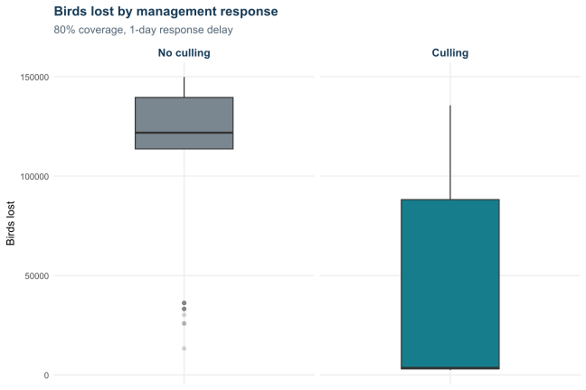

```{r}
#| label: setup
config <- jsonlite::fromJSON("config.json")
results <- readRDS("assets/spatial_cascade_results.rds")
summary <- read.csv("assets/spatial_cascade_summary.csv")
types <- read.csv("assets/spatial_cascade_production_type_summary.csv")
farms <- results$farms
runs <- results$monte_carlo_runs
days <- config$model_parameters$simulation_days
capacity_unit <- config$production_metrics$production_capacity_unit
if (is.null(capacity_unit) || !length(capacity_unit)) capacity_unit <- "birds"
mean_loss_share <- 100 * summary$mean_production_loss /
  sum(farms$production_yield)
protection_difference <- summary$protection_benefit_percentage_points
cull <- results$cull_comparison_summary
farm_risk <- results$farm_risk_summary
cull_farm_risk <- results$cull_farm_risk_summary
cull_average_survival <- results$cull_average_survival
north_name <- grep("^North", unique(farms$barrier_group), value = TRUE)[1]
south_name <- grep("^South", unique(farms$barrier_group), value = TRUE)[1]
initial_starts <- config$simulation_controls$initial_phase_c_entities

island_story <- function(group_name) {
  rows <- farms$barrier_group == group_name
  group_size <- sum(rows)
  start_probability <- 100 * (1 -
    choose(nrow(farms) - group_size, initial_starts) /
      choose(nrow(farms), initial_starts))
  group_risk <- mean(farm_risk$probability_lost_pct[
    farm_risk$barrier_group == group_name])
  sheltered_share <- 100 * mean(farms$is_sheltered[rows])
  data.frame(group = group_name, farms = group_size,
    start_probability = start_probability, mean_lost_probability = group_risk,
    sheltered_share = sheltered_share)
}

island_comparison <- rbind(island_story(north_name), island_story(south_name))
north <- island_comparison[island_comparison$group == north_name, ]
south <- island_comparison[island_comparison$group == south_name, ]
```

## Overview of the approach

This analysis asks a practical question: if a harmful event begins on a small
number of farms, how many birds could be lost, where could those losses occur,
and how much difference could a culling response make?

The analysis uses the fixed farm locations and attributes in
`r config$input_data$file`. It compares the same possible events twice: first
with no culling and then with the configured culling response. The two versions
start in the same places and use the same prepared chance values, so the main
difference is the management response. Detailed model settings and the reason
for repeating the scenarios are provided in the appendix.

## Birds in the farm population

Every scenario starts with the same birds and farms. This table provides the
starting context before any birds are lost. The farm-level figures describe
how birds are distributed across farms; they are not results.

```{r}
#| label: production-reference-table
#| tbl-cap: "Birds in the fixed farm population"
capacity_reference_row <- function(label, rows) {
  capacity <- farms$production_yield[rows]
  data.frame(
    `Production type` = label,
    Farms = length(capacity),
    `Total birds` = sum(capacity),
    `Share of all birds` = 100 * sum(capacity) /
      sum(farms$production_yield),
    `Average per farm` = mean(capacity),
    `Median per farm` = median(capacity),
    `Middle half per farm` = paste0(
      format(round(unname(quantile(capacity, .25))), big.mark = ","), " to ",
      format(round(unname(quantile(capacity, .75))), big.mark = ",")),
    `Minimum to maximum per farm` = paste0(
      format(round(min(capacity)), big.mark = ","), " to ",
      format(round(max(capacity)), big.mark = ",")),
    check.names = FALSE)
}
capacity_reference <- do.call(rbind, c(
  lapply(sort(unique(farms$production_type)), function(type) {
    capacity_reference_row(type, farms$production_type == type)
  }),
  list(capacity_reference_row("Grand total", rep(TRUE, nrow(farms))))))
capacity_reference$`Total birds` <- format(
  round(capacity_reference$`Total birds`), big.mark = ",")
capacity_reference$`Share of all birds` <- paste0(
  round(capacity_reference$`Share of all birds`, 1), "%")
capacity_reference$`Average per farm` <- paste(
  format(round(capacity_reference$`Average per farm`), big.mark = ","), capacity_unit)
capacity_reference$`Median per farm` <- paste(
  format(round(capacity_reference$`Median per farm`), big.mark = ","), capacity_unit)
capacity_reference$`Middle half per farm` <- paste(
  capacity_reference$`Middle half per farm`, capacity_unit)
capacity_reference$`Minimum to maximum per farm` <- paste(
  capacity_reference$`Minimum to maximum per farm`, capacity_unit)
knitr::kable(capacity_reference, row.names = FALSE)
```

The **Grand total** row gives all birds included in the analysis. Its average, median and
ranges describe individual farms across the complete input population.

## National bird losses

{#fig-loss-distribution fig-alt="Percentage of birds lost and remaining in scenarios with no culling and with culling"}

Each bar represents one possible national outcome. The orange share is birds
lost and the grey share is birds remaining. A bar that is 80% orange means
that scenario ended with 80% of all birds lost. The two
panels use the same percentage scale. Comparing their orange areas shows how
the culling response shifts the range of national outcomes. The sorting is
done separately in each panel, so bars in the same horizontal position are not
necessarily the same matched run.

Across the repeated scenarios, average total loss was
**`r format(round(summary$mean_production_loss), big.mark = ",")` `r capacity_unit`**, about
**`r round(mean_loss_share, 1)`%** of all birds. Nine out of ten scenarios finished between
**`r format(round(summary$loss_p05), big.mark = ",")` and
`r format(round(summary$loss_p95), big.mark = ",")` `r capacity_unit` lost**.

This is a widespread-loss result under the current settings. The average is
useful for a central planning case, while the upper end of the range shows what
a more severe outcome could look like. Because loss is already high in most
runs, moderate changes to protection may be difficult to distinguish unless
the spread and timing settings are well supported by evidence.

## The difference made by culling

The current policy reaches **`r round(cull$coverage_pct)`% of active farms**,
then culls each covered farm **`r cull$response_delay_days` day** after it
becomes active. There is no separate daily limit: once the response delay has
passed, every identified farm is culled.

{#fig-cull-comparison fig-alt="Birds lost in matched scenarios with no culling and with culling"}

Without culling, average loss was
**`r format(round(cull$mean_baseline_total_loss), big.mark = ",")` `r capacity_unit`**.
With culling, average loss was
**`r format(round(cull$mean_cull_total_loss), big.mark = ",")` `r capacity_unit`**.
That culling total already includes about
**`r format(round(cull$mean_direct_cull_loss), big.mark = ",")` `r capacity_unit`**
removed directly through culling.

After counting that direct loss, the response avoided an average of
**`r format(round(cull$mean_net_loss_avoided), big.mark = ",")` `r capacity_unit`**,
or **`r round(cull$net_loss_reduction_pct, 1)`% of the no-culling loss**. Total
loss was lower with culling in **`r round(cull$runs_with_lower_total_loss_pct, 1)`%
of the matched scenarios**. The average number of affected farms fell from
`r round(cull$mean_baseline_farms_affected, 1)` to
`r round(cull$mean_cull_farms_affected, 1)`, while an average of
`r round(cull$mean_farms_culled, 1)` farms were culled.

This result shows the trade-off clearly. Culling removes birds earlier to
prevent a much larger chain of bird losses. It does not mean this exact
result would occur in practice. The benefit depends on finding active farms,
reaching `r round(cull$coverage_pct)`% coverage, acting within
`r cull$response_delay_days` day.
Those assumptions should be tested against realistic response capability.

## Bird losses by production type

{#fig-loss-by-type fig-alt="Birds lost by production type with no culling and with culling"}

Production type does not change how the event spreads. It shows where bird
losses fall. A category with more farms or birds will generally have a larger
total loss. The panels compare the
same two management scenarios used throughout the report.

```{r}
#| label: type-table
#| tbl-cap: "Range of total bird losses across complete scenarios"
make_type_rows <- function(scenario, loss_log) {
  rows <- lapply(colnames(loss_log), function(type) {
    in_type <- farms$production_type == type
    birds_in_type <- sum(farms$production_yield[in_type])
    data.frame(Scenario = scenario, `Production type` = type, check.names = FALSE,
      Farms = sum(in_type), `Total birds` = birds_in_type,
      `Median total birds lost` = median(loss_log[, type]),
      `Loss p25` = unname(quantile(loss_log[, type], .25)),
      `Loss p75` = unname(quantile(loss_log[, type], .75)))
  })
  total_loss <- rowSums(loss_log)
  rows[[length(rows) + 1L]] <- data.frame(
    Scenario = scenario, `Production type` = "Total", check.names = FALSE,
    Farms = nrow(farms), `Total birds` = sum(farms$production_yield),
    `Median total birds lost` = median(total_loss),
    `Loss p25` = unname(quantile(total_loss, .25)),
    `Loss p75` = unname(quantile(total_loss, .75)))
  do.call(rbind, rows)
}

display <- rbind(
  make_type_rows("No culling", results$production_loss_by_type_log),
  make_type_rows("Culling", results$cull_production_loss_by_type_log))
display$`Total birds` <- format(round(display$`Total birds`), big.mark = ",")
display$`Median total birds lost` <- format(
  round(display$`Median total birds lost`), big.mark = ",")
display$`Middle half of results` <- paste0(
  format(round(display$`Loss p25`), big.mark = ","), " to ",
  format(round(display$`Loss p75`), big.mark = ","), " birds")
display$`Loss p25` <- display$`Loss p75` <- NULL
display <- display[, c("Scenario", "Production type", "Farms", "Total birds",
  "Median total birds lost", "Middle half of results")]
knitr::kable(display, row.names = FALSE)
```

This table describes **total birds lost across all farms in one complete
scenario**. It does not describe an average farm. The median is the middle
scenario result. The “middle half” leaves out the lowest and highest quarter of
the scenarios and shows how much the total can vary. The **Total** row covers
the full national farm population.

### Population bird-loss estimates

This separate table gives one population planning estimate by adding the
risk-weighted bird loss from every farm. It does not describe an average farm.
The production-type rows add to the national total within each management
response.

```{r}
#| label: population-loss-table
#| tbl-cap: "Estimated bird losses across the farm population"
make_population_rows <- function(scenario, risk_data) {
  rows <- lapply(sort(unique(risk_data$production_type)), function(type) {
    in_type <- risk_data$production_type == type
    total_birds <- sum(risk_data$production_yield[in_type])
    estimated_loss <- sum(risk_data$expected_loss_contribution[in_type])
    data.frame(
      `Management response` = scenario,
      `Production type` = type,
      `Farms in population` = sum(in_type),
      `Birds in population` = total_birds,
      `Estimated birds lost` = estimated_loss,
      `Estimated share of birds lost` = 100 * estimated_loss / total_birds,
      check.names = FALSE)
  })
  total_birds <- sum(risk_data$production_yield)
  estimated_loss <- sum(risk_data$expected_loss_contribution)
  rows[[length(rows) + 1L]] <- data.frame(
    `Management response` = scenario,
    `Production type` = "Total",
    `Farms in population` = nrow(risk_data),
    `Birds in population` = total_birds,
    `Estimated birds lost` = estimated_loss,
    `Estimated share of birds lost` = 100 * estimated_loss / total_birds,
    check.names = FALSE)
  do.call(rbind, rows)
}

population_estimates <- rbind(
  make_population_rows("No culling", farm_risk),
  make_population_rows("Culling", cull_farm_risk))
population_estimates$`Birds in population` <- format(
  round(population_estimates$`Birds in population`), big.mark = ",")
population_estimates$`Estimated birds lost` <- format(
  round(population_estimates$`Estimated birds lost`), big.mark = ",")
population_estimates$`Estimated share of birds lost` <- paste0(
  round(population_estimates$`Estimated share of birds lost`, 1), "%")
knitr::kable(population_estimates, row.names = FALSE)
```

“Estimated birds lost” is the sum of the farm-level risk-weighted bird losses
across the complete population. It is a planning estimate under the current
settings, not a count from one particular scenario and not a forecast of a
real event. In short: the first table shows the **range between complete
scenarios**; this table shows the **single population estimate** used for
planning. Neither table reports loss for an average farm.

## Birds remaining unaffected by shelter category

{#fig-shelter-comparison fig-alt="Faceted comparison of sheltered and unsheltered farm survival by production type with no culling and with culling"}

Without culling, sheltered survival averaged
**`r round(summary$sheltered_survival_pct, 1)`%**, compared with
**`r round(summary$unsheltered_survival_pct, 1)`%** for unsheltered farms. The difference was
**`r round(summary$protection_benefit_percentage_points, 1)` percentage
points**. With culling, the corresponding averages were
**`r round(cull_average_survival[[config$scenario_metadata$sheltered_label]], 1)`%**
and **`r round(cull_average_survival[[config$scenario_metadata$unsheltered_label]], 1)`%**.
This is a management-policy comparison: the culling panel changes the response,
while the farm population, starting locations and prepared chance values remain
matched to the no-culling panel.

```{r}
#| results: asis
if (protection_difference < 0) {
  cat(paste0(
    "In these results, sheltered farms have a slightly lower raw survival ",
    "rate. This does **not** mean shelter causes harm. The sheltered farms may ",
    "simply be in more exposed places or may have been chosen as starting ",
    "farms more often. The chart describes this farm population; it does not ",
    "prove what shelter caused.\n"
  ))
} else {
  cat(paste0(
    "Sheltered farms have a higher raw survival rate in these results. Some of ",
    "that difference may still come from where those farms are located, so it ",
    "should not be treated as proof of the shelter effect on its own.\n"
  ))
}
```

The cleanest future test would compare the same farms and the same starting
conditions twice: once with shelter protection and once without it. That would
separate the modelled shelter effect from differences in farm location.

## Where bird-loss exposure sits

{#fig-farm-risk fig-alt="New Zealand farm bird-loss exposure without culling and with culling"}

The left map shows the no-culling result and the right map shows the matched
culling result. Both bring the two islands into one view. Each bubble is one
farm at its fixed location, and larger bubbles represent more birds.
Because the colour scale is shared, the two panels can be compared directly.

In the no-culling panel, colour shows how often a farm reached the lost state
through the normal modelled chain. In the culling panel, a farm is also counted
as lost when it is culled. This is important: a coloured farm on the right may
represent an early, deliberate loss that helped prevent many other farms from
being reached.

For example, 40% means the farm was counted as lost in 40 out of every 100
modelled scenarios for that panel. It means all birds at that farm were counted
as lost in those runs; it is not a forecast that the event will occur. A high
value simply marks a farm that is frequently exposed under the chosen settings
and starting method.

Across all farms, the average lost-state probability falls from
**`r round(mean(farm_risk$probability_lost_pct), 1)`% without control** to
**`r round(mean(cull_farm_risk$probability_lost_pct), 1)`% with culling**.
On average, farms are directly culled in
**`r round(mean(cull_farm_risk$probability_culled_pct), 1)`% of scenarios**.
The right panel should therefore be read as a mix of farms removed by policy
and the smaller chain that continues despite that response.

The supporting farm-risk CSV also records how often each farm started a
scenario, how often it was affected, how often it was lost, and its expected
contribution to total loss. In random-start mode, some farms will be selected
as starting points more often than others just by chance. The current setup
selects each farm about
`r round(runs * config$simulation_controls$initial_phase_c_entities / nrow(farms), 1)`
times on average.

### Why the North Island looks more exposed

In the current results, the average chance of reaching the lost state is
**`r round(north$mean_lost_probability, 1)`% for North Island farms** and
**`r round(south$mean_lost_probability, 1)`% for South Island farms**. The main
reason is how the scenarios begin.

There are `r north$farms` North Island farms and `r south$farms` South Island
farms in the fixed population. With `r initial_starts` starting farms chosen at
random, at least one North Island farm starts the event in about
**`r round(north$start_probability, 1)`% of runs**. The South Island receives a
starting farm in about **`r round(south$start_probability, 1)`% of runs**.

The cross-island setting is currently 0, so an event cannot move from one
island to the other. If a run has no South Island starting farm, every South
Island farm stays unaffected in that run. The larger North Island population
therefore gives the North Island many more opportunities to be involved.

This should not be read as proof that North Island farms are naturally more
vulnerable. It is mainly a result of the number and location of farms, random
starting points, and the blocked island crossing. The shelter shares are also
fairly similar—`r round(north$sheltered_share, 1)`% in the North Island and
`r round(south$sheltered_share, 1)`% in the South Island—so shelter mix is not
the main explanation here. These figures will update automatically when the
full farm population is loaded and the analysis is rerun.

## What to take from these results

Under the current settings, the main message is that loss is widespread in
most scenarios. The range across runs matters because it shows that the final
loss is not fixed, even when the farm population stays the same. The map then
adds the local view by showing which farms are repeatedly exposed.

These results are best used to compare plausible settings and identify where
better evidence is needed. Straight-line distance cannot represent every real
pathway. Animal movements, staff, vehicles, shared equipment, wind, cleaning
practices and response actions may all change the real pattern. The model
should support discussion, not replace operational judgement.

# Appendix: Method and use

## Why the scenarios are repeated

One run gives only one possible chain of events. This analysis repeats the
whole scenario **`r format(runs, big.mark = ",")` times** over the same fixed
farm population. Starting farms and chance outcomes can differ between runs.
Looking across all runs shows the usual result as well as less common severe
outcomes.

More runs make the pattern steadier; they do not make the assumptions more
accurate. Results still depend on the farm data and the selected settings.

## How the comparison is set up

Each scenario begins with every farm unaffected and
`r config$simulation_controls$initial_phase_c_entities` farms starting the
event. The model follows the next `r days` days. A farm may be reached,
incubate, become active and then have all its birds counted as lost.

Every starting pattern is run twice. The no-culling and culling versions use
the same farms and prepared random values. This pairing keeps the comparison
focused on the management response rather than unrelated random differences.

## Timing and distance

{#fig-timing-distance fig-alt="Two-panel concept figure showing farm state timing and spatial transmission decay"}

The two parts of the model work together. **Timing controls when a farm can
spread. Distance controls how likely it is to reach another farm while it is
active.**

The left panel begins when a farm is reached. It spends
`r config$model_parameters$incubation_period_days` days incubating and cannot
spread during that period. It then becomes active for up to
`r config$model_parameters$active_period_days` days. Without control, it moves
to lost production at the end of that active period. If the farm is covered by
the culling policy, it is culled
`r config$cull_response$response_delay_days` day after becoming active and can
no longer spread. Coverage still matters: only
`r round(100 * config$cull_response$coverage)`% of active farms are selected
for that response under the current settings.

The right panel begins with one active farm and one unaffected farm. At short
distances, the model gives that transmission opportunity a higher chance. The
chance falls smoothly as distance increases. Shelter lowers the whole curve
for a sheltered farm. The different-island curve also includes the island
setting; with the current value of
`r config$model_parameters$cross_barrier_transmission_multiplier`, it stays at
zero because cross-island spread is blocked.

This curve describes one opportunity from one active source. When several
active farms can reach the same farm on the same day, the model combines those
opportunities, so the farm's overall chance of being reached can be higher than
one line alone suggests.

## Movement between islands

The farm data identify which island each farm belongs to. Farms on the same
island have no extra barrier. For farms on different islands, the model applies
the cross-island setting after allowing for distance and shelter.

The current value is
**`r config$model_parameters$cross_barrier_transmission_multiplier`**. A value
of 0 blocks spread between islands. A value such as 0.05 leaves a small
cross-island pathway, while 1 removes the extra island penalty but still allows
distance to reduce spread. A value above 0 should only be used when there is a
credible route, such as ferry movements, shared equipment or supplier links.

The grey New Zealand shape and optional regional lines help readers locate the
farms. They do not change the calculation.

## Running the analysis again

Start with the complete farm table in `data/farms.csv`. If column names change,
update the mappings in `config.json`. Review the starting-farm, timing,
distance, shelter, island, culling and run settings, then run
`source("spatial_cascade_monte_carlo.R")`. Refreshed figures and tables are
written to `assets/`. Run `quarto render spatial_cascade_report.qmd` to rebuild
this report.
