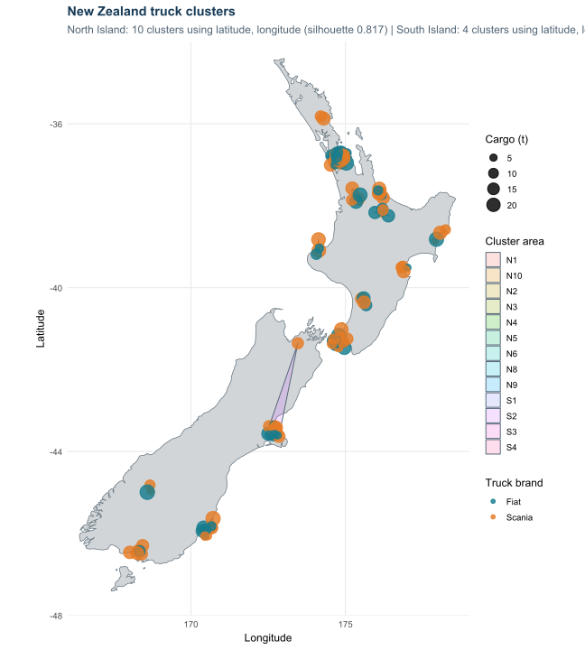
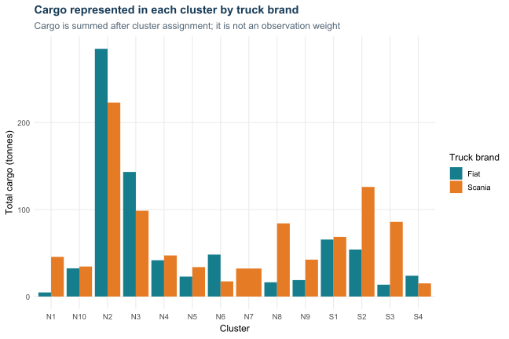

```{r}
#| label: setup
selection <- read.csv("outputs/cluster_model_selection.csv")
assignments <- readRDS("data/trucks_clustered.rds")
brand_summary <- read.csv("outputs/cluster_brand_summary.csv")
relevance <- read.csv("outputs/cluster_feature_relevance.csv")

best <- do.call(rbind, lapply(split(selection, selection$island), function(x) {
  x[order(-x$average_silhouette, x$k), ][1, ]
}))
best <- best[order(best$island), ]

risk <- aggregate(
  cbind(trucks = rep(1, nrow(assignments)), cargo_t = assignments$cargo_t),
  by = list(island = assignments$island, cluster = assignments$cluster),
  FUN = sum
)
brand_counts <- as.data.frame.matrix(with(assignments, table(cluster, truck_brand)))
brand_counts$cluster <- rownames(brand_counts)
risk <- merge(risk, brand_counts, by = "cluster", all.x = TRUE)
risk <- risk[order(-risk$trucks, -risk$cargo_t), ]

north <- best[best$island == "North Island", ]
south <- best[best$island == "South Island", ]
```

## What a cluster means

A cluster is a local zone containing trucks that are close together on the map.
It represents a group that could be affected by the same local fuel shortage.
If fuel supply is disrupted in or near a polygon, the trucks inside that
polygon are the group to check first.

The North and South Islands are analysed separately. A cluster never crosses
Cook Strait, because the model assumes trucks do not travel between islands.
North Island cluster names start with **N** and South Island names start with
**S**.

The coloured polygons on the map show the area covered by each cluster. The
dots are the trucks themselves:

- dot colour shows the truck brand;
- dot size shows the cargo carried; and
- the grey land area is only the map background, not a cluster.

{fig-alt="Map of New Zealand showing separate truck cluster polygons and truck points"}

## What the current results say

The automatic check selected **`r north$k` North Island zones** and
**`r south$k` South Island zones**. Truck locations and direct geographic
distance between their latitude and longitude coordinates define these zones. Cargo and
brand do not decide which zone a truck belongs to.

The separation scores were **`r round(north$average_silhouette, 3)`** for the
North Island and **`r round(south$average_silhouette, 3)`** for the South Island.
A score closer to 1 means each truck is clearly nearer to its own zone than to
the other zones. These results suggest the South Island zones are especially
clear, while the North Island zones are also well separated.

```{r}
#| label: selected-models
#| tbl-cap: "Automatically selected model for each island"
display_best <- best[, c("island", "k", "features", "average_silhouette")]
names(display_best) <- c("Island", "Clusters", "Inputs used", "Separation score")
display_best$`Separation score` <- round(display_best$`Separation score`, 3)
knitr::kable(display_best, row.names = FALSE)
```

The script uses geographic distance only. It automatically chooses the number
of zones that gives the clearest separation on each island. Fiat, Scania and
cargo are added afterwards to describe the exposure within each zone.

## Fuel-shortage risk view

The table below shows which zones have the most trucks and cargo exposed. A
zone with more trucks needs more immediate contact and fuel planning. A zone
with more cargo has more freight that could be delayed. Brand counts help show
which fleet contacts may be needed.

```{r}
#| label: risk-table
#| tbl-cap: "Truck and cargo exposure by geographic zone"
display_risk <- risk
names(display_risk)[names(display_risk) == "island"] <- "Island"
names(display_risk)[names(display_risk) == "cluster"] <- "Zone"
names(display_risk)[names(display_risk) == "trucks"] <- "Trucks"
names(display_risk)[names(display_risk) == "cargo_t"] <- "Cargo (t)"
display_risk$`Cargo (t)` <- round(display_risk$`Cargo (t)`, 1)
knitr::kable(display_risk, row.names = FALSE)
```

The cargo chart shows how much Fiat and Scania cargo sits within each cluster.
It can help identify areas where one brand has more trucks or cargo available.

{fig-alt="Cargo totals by cluster and truck brand"}

## How the cluster model works

The script follows four short steps:

1. Split the trucks into North and South Island data.
2. Calculate the geographic distance between every pair of trucks on the same
   island.
3. Test the cluster counts listed in `K_RANGE`.
4. Choose the number of geographic zones with the best separation score for
   each island.

The script allows between 2 and 12 clusters, then reduces the maximum separately
for each island to allow about eight trucks per cluster on average. For example,
25 trucks tests up to 3 clusters, 50 tests up to 6, 80 tests up to 10, and an
island with 100–200 trucks can test up to 12. These settings can be changed near
the top of `truck_cluster_analysis.R`.

Run the analysis from the R project folder with:

```{r}
#| eval: false
source("truck_cluster_analysis.R")
```

It updates the SVG charts and CSV result files in the `outputs` folder.

## Changing the dataset

Project data settings are kept in `project_config.R`. This avoids changing the
analysis or app code when the source data changes.

- Put replacement data in `data/trucks_input.csv`.
- If column names differ, update `TRUCK_COLUMNS` in `project_config.R`.
- Brands are not fixed. Add new brand values directly to the data; chart colours
  are assigned automatically.
- If truck age or type categories change, update `AGE_SPEED_MULTIPLIERS`.
- Rerun `source("truck_cluster_analysis.R")` to rebuild the stable clustered
  data used by the app.

The internal model keeps standard field names for reliability, while CSV files
and the truck-results table use the configured source column labels.

## The Shiny recruitment model

The Shiny app answers a different question. The cluster analysis describes
groups already present in the truck population. The Shiny model simulates how
selected trucks could recruit other trucks into a transport network.

At the start, one or more selected trucks are active. They try to recruit nearby
trucks within the chosen radius. A recruitment succeeds according to the chosen
information-transfer chance. Newly recruited trucks can recruit more trucks in
the next wave.

The app has two starting modes:

- **Individual trucks:** the selected trucks start active.
- **Truck clusters:** every truck in each selected geographic fuel-risk zone
  starts active. Recruitment still happens truck by truck after that.

Cargo does not create a link. It is counted only after a truck joins. Truck age
sets response speed: a new truck travels twice as fast as an old truck. North
Island trucks can recruit only North Island trucks, and the same rule applies to
the South Island.

The simulation stops when one of these occurs:

- no more trucks can be recruited;
- the cargo target is reached;
- the time limit is reached; or
- a new wave adds less cargo than the minimum set by the user.

## How to use the Shiny app

1. Open `trucks.Rproj` in RStudio.
2. Run `source("truck_cluster_analysis.R")` after changing the source truck
   population. This stores stable cluster assignments in the `data` folder.
3. Open `app.R` and select **Run App**.
4. Choose **Individual trucks** or **Truck clusters**.
5. Select one or more trucks or geographic clusters.
6. Set the recruitment radius and transfer chance.
7. Open **Speed and stopping parameters** if these settings need changing.
8. Select **Run Simulation**.
9. Review the map, cargo reached, cluster results, brand results and stopping
   reason.

A larger radius generally reaches more trucks but implies longer links. A
higher transfer chance makes recruitment more likely. Use the random seed to
repeat exactly the same chance outcomes.

## Important limits

This is a demonstration using generated truck locations and straight-line
distances. It does not yet use roads, ferries, depots, traffic, fuel costs or
driver hours. The results are useful for comparing model settings, but they are
not operating instructions for a real fleet.
